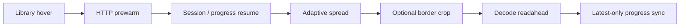

# LANraragi Nitro

**Upstream:** [Difegue/LANraragi](https://github.com/Difegue/LANraragi)

[한국어 (default)](README.md) · English ·
[Official LANraragi documentation](https://sugoi.gitbook.io/lanraragi/)

LANraragi Nitro is a feature fork that preserves LANraragi's core architecture
and plugin compatibility while extending its reader, library workflow,
duplicate review, and image pipeline. It focuses on making large archive
collections faster to browse, read, compare, and maintain.

## Feature overview

| Area | Nitro-exclusive features | Practical effect |
| --- | --- | --- |
| Reader | Adaptive double-page spreads, session-aware resume, edge tap zones, wheel/keyboard navigation, minimal fullscreen chrome | Mixed covers, wide pages, and portrait pages retain natural spreads, including after reloads. |
| Image pipeline | Optional blank-border cropping, crop cache and single-flight, libvips page-side detection, HTTP prewarming and decode readahead | Scans with large margins use more of the viewport while repeated image work and next-page waits are reduced. |
| Library | Newest-first default, quick filters, grid selection, right-click bulk actions, batched/lazy rendering, in-place deletion | Large result sets open faster and can be selected or cleaned up without full-page reloads. |
| Duplicate review | Versioned cover pHash, band index, title/source/language relation signals, focused queue, review status and event export | Review is narrowed to useful pairs with duplicate, translation, and subset context plus prior decisions. |
| Search and API | Search-result cache, metadata/file-list warmup, Tachiyomi-compatible hot path, progress migration | Repeated searches and reader entry are cheaper, while external-reader metadata and progress flows remain stable. |
| Runtime performance | Redis handle reuse, bounded page/metadata caches, pipelined metrics and OPDS fetches, optimized image serving | Repeated Redis connections, serialization, filesystem probes, and image response costs are reduced. |
| Reliability | Streamed upload checksums, archive path validation, stale async cancellation, change-aware CI gates | Large uploads use bounded memory, archive traversal is rejected, and validation scales with the changed surface. |
| UI | Catppuccin Mocha and OLED themes, responsive archive cards, compact reader controls | The library and reader remain consistent on small screens and OLED displays. |

## Reader flow

Prewarming fills only the HTTP cache; it does not eagerly decode images. Once
the reader opens, upcoming spreads are decoded relative to the current display
window. Navigation generations prevent stale asynchronous work from replacing
the current page or progress value.

## Performance tuning

Nitro performance work is governed by controlled A/B measurements and explicit
stop conditions. The current upstream cross-check produces a mixed result:
Nitro reaches `DOMContentLoaded` sooner, while current upstream reaches the
first visible image and completes warm full-archive navigation faster.

### Current upstream baseline

Lower is better. On 2026-07-19, the official upstream nightly
([`b94e4805`](https://github.com/Difegue/LANraragi/commit/b94e4805677d4ca75e7d61ca13c4e3e99c4b99c8),
image digest `sha256:fbd0b1bc…`) and the same-data Nitro runtime were measured
from the same macOS Chrome 150.0.7871.129 client.

| Reader metric | Upstream | Nitro | Nitro relative result |
| --- | ---: | ---: | ---: |
| Cold `DOMContentLoaded` p50 (`n=20`) | `87.4 ms` | **`77.8 ms`** | **11.0% lower** |
| Normalized DCL after module start, p50 (`n=20`) | `50.6 ms` | **`48.9 ms`** | **3.4% lower** |
| Cold first-visible p50 (`n=20`) | **`146.1 ms`** | `196.3 ms` | 34.4% higher |
| Warm 70-page full-traversal total p50 (3 runs each, 35 turns/run) | **`2,054.0 ms`** | `4,132.8 ms` | 101.2% higher |
| Warm turn p50 / p95 (`n=105`) | **`55.8 / 117.6 ms`** | `119.9 / 142.9 ms` | 114.9% / 21.5% higher |

The run used a `1440x900` viewport, double-page mode on, manga mode off,
preload `5`, and progress writes off. Cold startup consists of 20 independent
entries with the browser cache disabled. Warm traversal fills the cache, then
crosses the 70-page sample in 35 transitions, repeated three times. A turn ends
only after the page counter and primary source change, every non-empty visible
image is decoded, and `aria-busy=false`. Upstream ran in an isolated container
with read-only content and a cloned database. Background scanner/worker
processes were stopped to prevent reindexing; the Reader source remained the
unaltered official image.

### Latest Nitro internal A/B

These are Nitro control-versus-candidate results from the 2026-07-18 tuning
session, not claims against current upstream.

| Selected change | Control → candidate | Decision |
| --- | --- | --- |
| `reader-progress.js` module preload | normalized DCL p50 `97.8 → 83.7 ms` (**14.4% lower**) | Keep |
| Fetch-only rather than decoded Library intent | click-to-visible p95 `207 → 178 ms`; speculative decodes `20 → 0`; estimated RGBA retention `291.7 MB → 0` | Keep |
| Abort stale intent and promote the selected target | stale transfer `6,237,558 → 5,869 bytes` (**99.91% lower**) | Keep |
| Protect displayed Blob sources from eviction | displayed-source revokes `104 → 0`; page resources `222 → 207`; p95 change `+1.8%` | Keep |

This is a regression baseline for one client and one high-resolution archive
cohort, not a universal benchmark across devices and libraries. The warm
navigation gap against current upstream is an explicit priority for the next
Reader tuning round. Improvements against an older Nitro control are not
presented as evidence that Nitro is faster than upstream.

## Feature details

### Reader and progress

- Covers and wide pages remain single, while portrait pages form double-page
  windows using the active anchor and detected page side.
- Explicit reloads, shifted spreads, and manga reading direction preserve the
  intended navigation stride.
- Session position is separated from persistent reading progress so browser
  reload and Library-open behavior remain distinct.
- Edge taps, mouse wheel, arrows, PageUp/PageDown, WASD, page-number jumps, and
  a confirmed Delete shortcut are supported.
- Disabling progress tracking also disables implicit resume and background
  progress writes.

### Library workflow

- The index defaults to newest-first when neither URL nor saved order overrides
  it.
- Quick filters share DataTables search state and avoid duplicate searches.
- Grid selection is isolated behind the card context-menu seam, with common
  bulk actions available directly from the selection banner.
- Deletion reconciles the current grid, counts, and carousel state in place.
- Lazy thumbnails and batched card insertion reduce initial rendering work for
  large result sets.

### Duplicate review

- Versioned perceptual hashes and cover-band buckets find visually close
  candidates first.
- Page count, lead-page hashes, normalized title, language, source, and a
  quality proxy help classify duplicate, translation, and subset candidates.
- The focused queue ignores stale responses and presents pair-relative chips
  with keep/delete suggestions.
- Dismissed and review states persist, while bounded snapshots and pair features
  can be recorded and exported as review events.
- Archive members and temporary extraction paths are validated so analysis
  cannot write outside its temporary root.

### Performance and reliability

- Redis connections and archive-path lookups are reused per worker.
- Bounded caches cover page responses, metadata, file lists, and reader Blob
  URLs, with archive-scoped invalidation.
- Crop requests use single-flight behavior and safely fall back to the original
  page when cropping is unavailable or fails.
- Metrics writes and OPDS archive fetches are pipelined or batched.
- Upload checksums are streamed instead of loading whole files into memory.
- CI classifies changed files and selects proportional frontend, Perl, OpenAPI,
  browser-evidence, runtime, and build gates.

## Upstream compatibility

This fork periodically synchronizes with LANraragi's `dev` branch. Installation,
configuration, archive management, and plugin development generally follow the
upstream project. Use the
[official documentation](https://sugoi.gitbook.io/lanraragi/) for initial setup
and base LANraragi behavior.

Issues limited to Nitro features belong in this fork. Before reporting an issue
upstream, verify that it also reproduces in upstream LANraragi.

## License

LANraragi Nitro retains LANraragi's MIT license. See [COPYING](COPYING).
