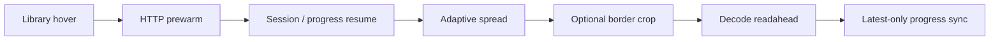

# LANraragi Nitro

**Upstream:** [Difegue/LANraragi](https://github.com/Difegue/LANraragi)

[한국어 (default)](README.md) · English ·
[Official LANraragi documentation](https://sugoi.gitbook.io/lanraragi/)

LANraragi Nitro is a feature fork that preserves LANraragi's core architecture
and plugin compatibility while extending its reader, library workflow,
duplicate review, and image pipeline. It focuses on making large archive
collections faster to browse, read, compare, and maintain.

## Feature overview

| Area | Nitro-exclusive features | Practical effect |
| --- | --- | --- |
| Reader | Adaptive double-page spreads, session-aware resume, edge tap zones, wheel/keyboard navigation, minimal fullscreen chrome | Mixed covers, wide pages, and portrait pages retain natural spreads, including after reloads. |
| Image pipeline | Optional blank-border cropping, crop cache and single-flight, libvips page-side detection, HTTP prewarming and decode readahead | Scans with large margins use more of the viewport while repeated image work and next-page waits are reduced. |
| Library | Newest-first default, quick filters, grid selection, right-click bulk actions, batched/lazy rendering, in-place deletion | Large result sets open faster and can be selected or cleaned up without full-page reloads. |
| Duplicate review | Versioned cover pHash, band index, title/source/language relation signals, focused queue, review status and event export | Review is narrowed to useful pairs with duplicate, translation, and subset context plus prior decisions. |
| Search and API | Search-result cache, metadata/file-list warmup, Tachiyomi-compatible hot path, progress migration | Repeated searches and reader entry are cheaper, while external-reader metadata and progress flows remain stable. |
| Runtime performance | Redis handle reuse, bounded page/metadata caches, pipelined metrics and OPDS fetches, optimized image serving | Repeated Redis connections, serialization, filesystem probes, and image response costs are reduced. |
| Reliability | Streamed upload checksums, archive path validation, stale async cancellation, change-aware CI gates | Large uploads use bounded memory, archive traversal is rejected, and validation scales with the changed surface. |
| UI | Catppuccin Mocha and OLED themes, responsive archive cards, compact reader controls | The library and reader remain consistent on small screens and OLED displays. |

## Reader flow

Prewarming fills only the HTTP cache; it does not eagerly decode images. Once
the reader opens, upcoming spreads are decoded relative to the current display
window. Navigation generations prevent stale asynchronous work from replacing
the current page or progress value.

## Adaptive offset

Adaptive offset is a per-archive feature that keeps covers and wide pages
single while aligning the first portrait double-page spread as either
`Pair 2-3` or `Pair 3-4`.

- The server detector analyzes early interior pages and stores `2`, `4`, or
  `UNKNOWN`. It uses libvips first and ImageMagick as a fallback.
- In `auto` mode, the reader combines that result with known wide pages to build
  display windows, safely falling back to `Pair 2-3` for `UNKNOWN` results.
- In the minimal or fullscreen reader, `Up`/`Down` or `W`/`S` shifts a spread by
  one page for immediate pairing correction. An unambiguous correction is saved
  as human-confirmed feedback only after the next ordinary page turn succeeds.
- `J` toggles the current archive between adaptive `auto` mode and fixed
  `Pair 2-3`. Shifted spreads retain their double-page stride across reloads and
  ordinary previous/next navigation.

## Reader performance comparison

Lower is better. On 2026-07-19, official upstream
[`b94e4805`](https://github.com/Difegue/LANraragi/commit/b94e4805677d4ca75e7d61ca13c4e3e99c4b99c8) and
the same Reader pipeline published in Nitro
[`653420ac`](https://github.com/sgu11/lanraragi-nitro/commit/653420ac72f0172f319f7dc27f2da47f78e108f0)
were compared on the same 70-page WebP archive. The run used Chrome 150, a
`1440x900` viewport, double-page mode, preload `5`, and progress writes off.

```mermaid
xychart-beta
    title "Reader latency comparison - lower is better"
    x-axis ["First visible p50", "First visible p95", "Warm turn p50", "Warm turn p95", "Warm turn max"]
    y-axis "Latency (ms)" 0 --> 150
    bar "Upstream" [130.6, 138.6, 18.6, 29.0, 49.8]
    bar "Nitro" [104.4, 124.2, 25.7, 27.7, 31.0]
```

| Reader latency | Upstream | Nitro | Nitro relative result |
| --- | ---: | ---: | ---: |
| First-visible p50 | `130.6 ms` | **`104.4 ms`** | **20.1% lower** |
| First-visible p95 | `138.6 ms` | **`124.2 ms`** | **10.4% lower** |
| Warm page-turn p50 | **`18.6 ms`** | `25.7 ms` | 38.2% higher |
| Warm page-turn p95 | `29.0 ms` | **`27.7 ms`** | **4.5% lower** |
| Warm page-turn max | `49.8 ms` | **`31.0 ms`** | **37.8% lower** |

Nitro lowers first-visible and warm tail latency, while upstream retains the
lower warm p50. This is a regression baseline for one client and one archive
cohort, not a universal benchmark across devices and libraries.

## Feature details

### Reader and progress

- Explicit reloads, shifted spreads, and manga reading direction preserve the
  intended navigation stride.
- Session position is separated from persistent reading progress so browser
  reload and Library-open behavior remain distinct.
- Edge taps, mouse wheel, arrows, PageUp/PageDown, WASD, page-number jumps, and
  a confirmed Delete shortcut are supported.
- Disabling progress tracking also disables implicit resume and background
  progress writes.

### Library workflow

- The index defaults to newest-first when neither URL nor saved order overrides
  it.
- Quick filters share DataTables search state and avoid duplicate searches.
- Grid selection is isolated behind the card context-menu seam, with common
  bulk actions available directly from the selection banner.
- Deletion reconciles the current grid, counts, and carousel state in place.
- Lazy thumbnails and batched card insertion reduce initial rendering work for
  large result sets.

### Duplicate review

- Versioned perceptual hashes and cover-band buckets find visually close
  candidates first.
- Page count, lead-page hashes, normalized title, language, source, and a
  quality proxy help classify duplicate, translation, and subset candidates.
- The focused queue ignores stale responses and presents pair-relative chips
  with keep/delete suggestions.
- Dismissed and review states persist, while bounded snapshots and pair features
  can be recorded and exported as review events.
- Archive members and temporary extraction paths are validated so analysis
  cannot write outside its temporary root.

### Performance and reliability

- Redis connections and archive-path lookups are reused per worker.
- Bounded caches cover page responses, metadata, file lists, and reader Blob
  URLs, with archive-scoped invalidation.
- Crop requests use single-flight behavior and safely fall back to the original
  page when cropping is unavailable or fails.
- Metrics writes and OPDS archive fetches are pipelined or batched.
- Upload checksums are streamed instead of loading whole files into memory.
- CI classifies changed files and selects proportional frontend, Perl, OpenAPI,
  browser-evidence, runtime, and build gates.

## Upstream compatibility

This fork periodically synchronizes with LANraragi's `dev` branch. Installation,
configuration, archive management, and plugin development generally follow the
upstream project. Use the
[official documentation](https://sugoi.gitbook.io/lanraragi/) for initial setup
and base LANraragi behavior.

Issues limited to Nitro features belong in this fork. Before reporting an issue
upstream, verify that it also reproduces in upstream LANraragi.

## License

LANraragi Nitro retains LANraragi's MIT license. See [COPYING](COPYING).
