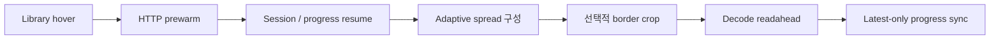

# LANraragi Nitro

**Upstream:** [Difegue/LANraragi](https://github.com/Difegue/LANraragi)

한국어 (기본) · [English](README.en.md) ·
[LANraragi 공식 문서](https://sugoi.gitbook.io/lanraragi/)

LANraragi Nitro는 LANraragi의 기본 구조와 plugin 호환성을 유지하면서
reader, library workflow, duplicate review, image pipeline을 확장한 feature
fork입니다. 많은 archive를 더 빠르게 탐색하고, 읽고, 비교하고, 정리하는
과정에 초점을 둡니다.

## 기능 요약

| 영역 | Nitro 전용 기능 | 사용자가 체감하는 변화 |
| --- | --- | --- |
| Reader | Adaptive double-page spread, session-aware resume, edge tap zone, wheel/keyboard navigation, minimal fullscreen chrome | 표지·wide page·일반 page가 섞여 있어도 자연스러운 spread를 유지하고, reload 후에도 읽던 위치와 stride를 복원합니다. |
| Image pipeline | 선택적 blank-border crop, crop cache와 single-flight, libvips 기반 page-side 감지, HTTP prewarm과 decode readahead | 여백이 큰 scan을 화면에 더 크게 표시하고, 다음 page의 대기와 중복 image 작업을 줄입니다. |
| Library | Newest-first 기본 정렬, quick filter, grid selection, right-click bulk action, batched/lazy rendering, in-place deletion | 큰 library에서도 목록을 빠르게 열고 여러 archive를 선택·삭제하며, 작업 후 전체 page를 reload하지 않습니다. |
| Duplicate review | Versioned cover pHash, band index, title/source/language 관계 신호, focused comparison queue, review status와 event export | 단순 후보 목록 대신 비교할 pair를 좁혀 보여 주고, translation·subset·duplicate 관계와 이전 판단을 함께 검토할 수 있습니다. |
| Search와 API | Search-result cache, archive metadata/file-list warmup, Tachiyomi-compatible hot path, progress migration | 반복 검색과 reader 진입 비용을 줄이고, 외부 reader가 요청하는 metadata와 progress 흐름을 안정화합니다. |
| Runtime 성능 | Redis handle reuse, bounded page/metadata cache, pipelined metrics와 OPDS fetch, optimized thumbnail/image serving | 반복 요청의 Redis 연결, serialization, filesystem probe와 image response 비용을 줄입니다. |
| 안정성과 검증 | Streamed upload checksum, archive path validation, stale async request cancellation, change-aware CI gate | 큰 upload의 memory 사용을 제한하고, archive traversal과 오래된 UI 응답을 방어하며, 변경 범위에 맞는 검증을 실행합니다. |
| UI | Catppuccin Mocha와 OLED theme, responsive archive card, compact reader controls | Library와 reader를 작은 화면과 OLED 환경에서도 일관된 layout으로 사용할 수 있습니다. |

## Reader 동작 흐름

Prewarm은 image를 미리 decode하지 않고 reader 진입에 필요한 HTTP cache만
준비합니다. Reader가 열린 뒤에는 현재 display window를 기준으로 다음
spread를 decode하며, 오래된 navigation 결과가 새 화면이나 progress를
덮어쓰지 않도록 요청 세대를 구분합니다.

## 성능 튜닝

Nitro의 성능 작업은 추측이 아니라 동일 조건 A/B와 명시적인 중단 기준으로
관리합니다. 현재 upstream과의 교차 측정에서는 시작 단계와 실제 page
navigation의 결과가 서로 달랐습니다. Nitro는 `DOMContentLoaded`가 빠르지만,
현재 upstream은 첫 image 표시와 warm 전체 순회가 더 빠릅니다.

### 현재 upstream 기준선

짧을수록 좋은 지표입니다. 2026-07-19에 official upstream nightly
([`b94e4805`](https://github.com/Difegue/LANraragi/commit/b94e4805677d4ca75e7d61ca13c4e3e99c4b99c8),
image digest `sha256:fbd0b1bc…`)와 동일 데이터의 Nitro runtime을 같은
macOS Chrome 150.0.7871.129에서 교차 측정했습니다.

| Reader 지표 | Upstream | Nitro | Nitro 상대 결과 |
| --- | ---: | ---: | ---: |
| Cold `DOMContentLoaded` p50 (`n=20`) | `87.4 ms` | **`77.8 ms`** | **11.0% 단축** |
| Module 시작 이후 normalized DCL p50 (`n=20`) | `50.6 ms` | **`48.9 ms`** | **3.4% 단축** |
| Cold first-visible p50 (`n=20`) | **`146.1 ms`** | `196.3 ms` | 34.4% 증가 |
| Warm 70-page 전체 순회 total p50 (각 3회, 35 turns/run) | **`2,054.0 ms`** | `4,132.8 ms` | 101.2% 증가 |
| Warm turn p50 / p95 (`n=105`) | **`55.8 / 117.6 ms`** | `119.9 / 142.9 ms` | 114.9% / 21.5% 증가 |

측정은 `1440x900`, double-page on, manga mode off, preload `5`, progress write
off에서 수행했습니다. Cold startup은 browser cache를 끈 20회 독립 진입,
warm 순회는 cache를 채운 뒤 70-page sample을 35회 전환하는 과정을 3회
반복했습니다. 각 turn은 page counter와 primary source가 바뀌고, 비어 있지
않은 모든 표시 image가 decode되며, `aria-busy=false`가 된 시점에 끝납니다.
Upstream은 read-only content와 복제 DB를 사용한 격리 container에서
측정했고, 재색인을 막기 위해 background scanner/worker만 중지했습니다.
Reader source는 official image 그대로입니다.

### 최근 Nitro 내부 A/B

아래 값은 현재 upstream과의 비교가 아니라, 2026-07-18 tuning session에서
Nitro control과 candidate를 같은 조건으로 비교한 결과입니다.

| 선택한 변경 | Control → candidate | 결정 |
| --- | --- | --- |
| `reader-progress.js` module preload | normalized DCL p50 `97.8 → 83.7 ms` (**14.4% 단축**) | 유지 |
| Library intent를 decode 대신 fetch-only로 전환 | click-to-visible p95 `207 → 178 ms`; speculative decode `20 → 0`; estimated RGBA retention `291.7 MB → 0` | 유지 |
| Stale intent abort와 selected-target promotion | stale transfer `6,237,558 → 5,869 bytes` (**99.91% 감소**) | 유지 |
| 표시 중 Blob source eviction 방지 | displayed-source revoke `104 → 0`; page resources `222 → 207`; p95 변화 `+1.8%` | 유지 |

이 기준선은 단일 client와 단일 고해상도 archive cohort의 회귀 지표이지,
모든 기기와 library를 대표하는 종합 benchmark는 아닙니다. 특히 최신
upstream 대비 warm navigation 격차는 다음 Reader tuning의 명시적인 우선
과제이며, 과거 Nitro 자체 baseline 대비 개선만으로 upstream보다 빠르다고
주장하지 않습니다.

## 주요 기능 자세히 보기

### Reader와 progress

- Cover와 wide page는 single-page로 유지하고, portrait page는 현재 anchor와
  page-side 감지 결과에 따라 double-page window를 구성합니다.
- 명시적인 page reload, shifted spread, manga reading direction에서도 동일한
  navigation stride를 유지합니다.
- Session page와 영구 progress를 분리하여 Library에서 다시 열 때와 browser
  reload 때의 동작을 구분합니다.
- Edge tap, mouse wheel, arrow/PageUp/PageDown, WASD, page-number jump와
  Delete shortcut을 지원합니다.
- 진행 기록을 끈 경우 암묵적인 resume이나 background write를 수행하지
  않습니다.

### Library workflow

- URL 또는 저장된 정렬 설정이 없으면 최신 archive부터 표시합니다.
- Quick filter와 DataTables state를 공유하여 불필요한 중복 search를 피합니다.
- Grid card의 context-menu seam을 통해 selection을 관리하고, selection
  banner에서 delete 같은 주요 bulk action에 바로 접근합니다.
- Archive 삭제 후 현재 grid, count, carousel state를 제자리에서 갱신합니다.
- Thumbnail은 lazy-load하고 card 삽입을 batch 처리하여 큰 결과 목록의 초기
  rendering 부담을 줄입니다.

### Duplicate review

- Versioned perceptual hash와 cover band bucket으로 가까운 cover 후보를 먼저
  찾습니다.
- Page count, lead-page hash, normalized title, language, source와 quality proxy를
  조합하여 `duplicate`, `translation`, `subset` 후보를 분류합니다.
- Focused queue는 stale response를 무시하며, pair별 비교 chip과 delete/keep
  제안을 한 화면에 표시합니다.
- Dismissed/review status를 보존하고, 판단 당시의 제한된 snapshot과 feature를
  event log로 기록·export할 수 있습니다.
- Archive member path와 temporary extraction 경로를 검증하여 duplicate 분석이
  원래 archive 밖에 파일을 쓰지 않도록 방어합니다.

### Performance와 reliability

- Worker별 Redis connection과 archive-path lookup을 재사용합니다.
- Page response, metadata, file list와 reader Blob URL에 bounded cache를
  적용하고 archive 변경 시 관련 entry를 무효화합니다.
- Crop request는 single-flight로 합치며, crop 불가 또는 실패 시 원본 page로
  안전하게 fallback합니다.
- Metrics write와 OPDS archive fetch를 pipeline/batch 처리합니다.
- Upload checksum은 전체 파일을 memory에 올리지 않고 stream으로 검증합니다.
- CI는 변경 파일을 분류하여 frontend, Perl, OpenAPI, browser evidence와
  runtime/build gate를 필요한 범위에 맞춰 선택합니다.

## Upstream 호환성

이 fork는 LANraragi `dev` branch를 기준으로 주기적으로 동기화합니다. 기본
설치, 설정, archive 관리와 plugin 개발 방식은 upstream을 따릅니다. 처음
설치하거나 LANraragi 자체 기능을 확인하려면
[공식 문서](https://sugoi.gitbook.io/lanraragi/)를 사용하십시오.

Nitro 전용 기능에서만 재현되는 문제는 이 fork에서 다뤄야 합니다. Upstream에
issue를 제출하기 전에는 같은 문제가 upstream LANraragi에서도 재현되는지
확인하십시오.

## License

LANraragi Nitro는 LANraragi의 MIT license를 유지합니다. 자세한 내용은
[COPYING](COPYING)을 참고하십시오.
